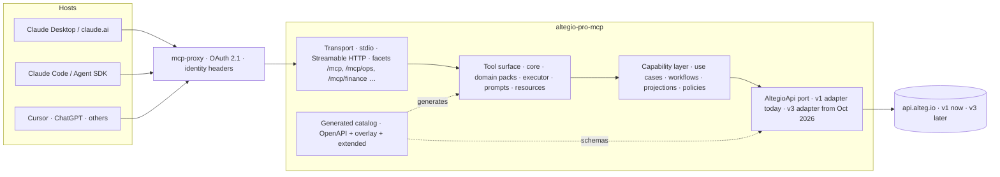

# ADR-001 — Altegio Pro MCP over the full Altegio API

- **Status:** Proposed — needs ratification by the product owner and the API platform team (open decisions in §8).
- **Date:** 2026-09-07
- **Scope:** how one MCP product covers an API of ~1,200 routes (documented and undocumented), how it survives the V1 → V3 migration, and how it stays usable inside the context-window and tool-count limits of today's MCP hosts.

## 1. Context — measured, not assumed

### 1.1 Size of the API surface (2026-09-07)

Numbers come from `scripts/api-inventory/` run against `../biz.erp.api.docs` (master) and the backend route files in `../biz.erp` (Slim route registrations, deduplicated by method + path).

| Surface | Routes / operations | Notes |
|---|---:|---|
| Backend `/api/v1` routes | **1,176** | `api.php` 962 · `api_legacy.php` 128 · `booking.php` 58 · `backoffice.php` 28 |
| Documented v1 + public + developers | **304** | v1 260 · public 24 · developers 20 (16 marked deprecated) |
| Backend v1 routes matched by docs | 253 | exact method + normalized-path match |
| Backend v1 routes **not documented** | **923** | 788 of them in `api.php` |
| Documented ops with no exact backend match | 51 | aliases (`{location_id}` vs `{salonId}`) or stale entries; needs review |
| Backend `/api/v2` routes | 54 | JSON:API, **internal ERP-web only** by API-team policy; 42 documented |
| `/api/v3` (preview contract) | 57 ops · 37 paths · 12 tags | all `x-altegio-status: preview`; first production release planned **October 2026** (API team flags the date as red risk) |

Where the undocumented v1 routes live (first path segments, top groups):

| Group | Undocumented routes | Reading |
|---|---:|---|
| `company/{id}/…` | 365 | location-scoped business features: the main gap for this product |
| `chain/{id}/…` | 47 | chain-level operations |
| `booking/…` (locations, user, chains, search, forms, payments) | 46 | public booking widget internals — out of scope (B2C) |
| `marketplace/…` | 43 | developer / application management — different persona |
| `medicine/{id}/…` | 22 | vertical module |
| `supermod/…`, `security/…`, `translate/…`, `landing/…`, `support/…` | ~60 | first-party / internal admin, never exposed |
| `tips`, `group`, `integration_wizard`, `client_app`, `segments`, `promo_codes`, … | rest | mixed; triage per domain |

Conclusion: roughly a third of the undocumented surface is relevant to business owners and administrators (the `company/{id}` and `chain/{id}` groups plus a few utilities); the rest is internal or belongs to other personas. **Undocumented means no contract**: those routes serve the ERP web client and can change without notice.

### 1.2 What the API team has already decided (biz.erp `docs/research/api-standardization/v3-plan`)

- **V3 is the only new public contract.** Flat REST under `/api/v3/locations/{location_id}/…`, `problem+json` errors with stable `code`, cursor pagination, `Idempotency-Key`, `If-Match`, OpenAPI 3.1 as the contract with a CI gate in both repos (`x-altegio-status: available` requires a registered route).
- **V2 stays internal**, V1 is legacy: no new public methods are added to V1.
- **Auth is OAuth 2.1**: Authorization Code + PKCE for agents and MCP hosts (DCR and Client ID Metadata Documents accepted), Client Credentials for marketplace backends, restricted keys for a business's own scripts. **There is no password grant in V3.** Token audiences are split: `https://api.alteg.io/api/v3` for REST and a separate MCP audience for a hosted MCP; a REST token is not accepted by MCP and vice versa.
- **The first audience of V3 is external partners and MCP/AI integrations.** The team also plans the backend use-case layer so that "REST v3 controller, MCP tool handler and legacy v2 adapter call one shared service" (guardrails §9) — a future in-process MCP inside the monolith is on their table.

### 1.3 The MCP host landscape this product must fit (September 2026)

| Host / mechanism | Fact | Consequence for us |
|---|---|---|
| MCP spec **2026-07-28** (final) | Stateless core, no `Mcp-Session-Id`; `tools/list` must not vary per connection and should be deterministic; `ttlMs` / `cacheScope` on list results; Tasks and MCP Apps are extensions; MRTR replaces server-initiated elicitation; `Mcp-Method` / `Mcp-Name` headers allow gateway routing by tool name. Roots, Sampling and Logging deprecated. | No per-session tool toggling. Static tool lists. Cross-call state travels as server-minted handles in tool arguments. Sharding by tool name is a deployment detail, invisible to clients. |
| TypeScript SDK | `1.30.0` = protocol 2025-11-25 (we are on 1.29). `2.0.0` is a **beta** with dual-era `createMcpHandler`; 1.x servers keep working for 2.x clients indefinitely. Platform plan: canary SDK v2 on one low-risk server first. | Stay on 1.x now, design for the 2026-07-28 constraints, migrate after the platform canary. |
| Claude API tool search (`defer_loading`, `mcp_toolset.default_config`) | Up to 10,000 deferred tools; search matches names, descriptions, argument names and descriptions; keep the 3–5 hottest tools non-deferred; Anthropic's own guidance: selection accuracy degrades past 30–50 loaded tools. | A large catalog is viable **if** names carry consistent prefixes and descriptions carry the user's vocabulary. |
| Claude Code / Agent SDK | Tool search on by default (`ENABLE_TOOL_SEARCH`, `auto` threshold 10 % of context). Reported and unresolved: tools from **HTTP** MCP servers are not deferred (issue #40314, closed "not planned"). | Cannot rely on deferral for our HTTP deployment. Need a compact default view. |
| claude.ai connectors | Connector tools appear as deferred tools in Claude Code sessions; behaviour on claude.ai web not documented. | Same as above. |
| Cursor | Hard cap of **40 active tools across all servers**; overflow is silently dropped. | A default endpoint must stay well under 40 tools. |

### 1.4 Where the current server stands

42 tools, all on V1, defined through `defineTool` (Zod → JSON Schema, annotations, `outputSchema`, structured output), an onboarding wizard with file-backed state, request-scoped delegated identity behind the platform's OAuth proxy (`x-mcp-auth-*` headers), stdio + Streamable HTTP, protocol 2025-11-25, spec-compliance tests mapping tools to OpenAPI operations (`src/tools/api-mapping.ts`). No MCP prompts or resources are registered although the capability is declared. Tool names already use the V3 glossary (location, team member, appointment).

## 2. Decision in one paragraph

Build **one product, one server, one endpoint and one OAuth audience**, not a family of thematic MCP servers. Inside it, organise the API as a **catalog** (OpenAPI + curated overlay) that generates domain tool packs, keep a small always-loaded **core** of task-shaped tools, add a **universal executor** for the long tail, and publish **facets** — static, filtered views of the same catalog on sub-paths — for hosts that cannot defer tools. Tool contracts speak the V3 glossary from day one; V1 is an adapter behind a port, so the October V3 release replaces adapters, not tools. Undocumented endpoints enter the product only through an explicit allowlist with contract tests, and the inventory that finds them feeds the spec repository, not the MCP directly.

## 3. Decisions

### D1 — One server, one audience (not N thematic servers)

Thematic servers look attractive for context economy, but every argument for them is solved today by tool search, static facets, and header-based routing, while their costs stay:

- Business workflows cross domains constantly (booking = availability + client + team member + service + payment). Splitting servers pushes composition onto the model.
- Each server is a separate OAuth audience in `mcp-proxy/routes.json`, a separate consent, a separate credential store, a separate deploy, a separate eval suite.
- Prompt caching favours one stable tool prefix per session over several servers loaded and unloaded.
- The 2026-07-28 spec lets a gateway route by `Mcp-Name`; if we ever need to shard processes by domain, we can do it behind the endpoint without touching clients.

Separate servers are reserved for **different personas or audiences**: public booking (B2C, end clients), marketplace developers (`developers` API). Neither is in scope of Altegio Pro.

### D2 — Three-tier tool surface

| Tier | What | Size | Loading |
|---|---|---|---|
| **Core** | Task-shaped tools that answer the daily questions of an owner or administrator: today's journal, find availability, book / reschedule / cancel, client lookup and client card, staff schedule, service catalog basics, sales summary, onboarding entry points, auth, `list_locations`, plus the three executor tools below. | ≤ 24 | Always loaded; the only tools most sessions ever need. |
| **Domain packs** | CRUD and reporting tools generated from the catalog per domain: `staff_*`, `services_*`, `clients_*`, `appointments_*`, `visits_*`, `payments_*`, `schedule_*`, `settings_*`, `analytics_*`, `loyalty_*`, `inventory_*`, `salary_*`, `notifications_*`, `chain_*`. Curated descriptions, projections, annotations. | hundreds over time | Deferred where the host supports tool search; otherwise exposed through facets (D3). |
| **Universal executor** | `altegio_search_operations` (query → operations with one-line summaries), `altegio_describe_operation` (full input/output schema, examples, permissions), `altegio_call_operation` (validated call). Backed by the same catalog. | 3 | Always loaded. Covers every documented operation the day the spec changes, before anyone curates a tool. |

Executor policy: any **documented read** is callable; **writes** only for operations on an allowlist (curated packs cover the common ones); **undocumented** operations only when they carry an extended-catalog entry with a golden contract test (D4). Results pass through the same projection and size budget as curated tools.

### D3 — Facets: static views on sub-paths

`/mcp` (default) serves core + the most used packs and must stay under **40 tools**. `/mcp/<facet>` serves a fixed subset per facet: `ops` (journal, appointments, clients), `catalog` (services, staff, schedule, settings), `finance` (visits, payments, analytics, salary), `marketing` (loyalty, notifications, chain), `onboarding`. Facet membership is a field in the curation overlay; lists are computed once at startup, deterministic and cacheable — compliant with the 2026-07-28 "no per-connection variance" rule, unlike runtime tool toggling.

The platform proxy forwards everything under `/pro/*` to the service, so facets need no new routes, audiences or scopes. Facets are a compatibility shim for hosts without tool search; they are not product boundaries and share one credential.

### D4 — The catalog is the source of truth; generation happens at build time

```
../biz.erp.api.docs (OpenAPI v1 / public / developers / v3)
        │  + catalog/overlay/*.yaml   (names, descriptions, hidden params, projections,
        │                              annotations, domain, tier, facets, write allowlist)
        │  + catalog/extended/*.yaml  (hand-written stubs for allowlisted undocumented
        │                              endpoints, each with a golden contract test)
        ▼
scripts/catalog/build.mjs  ──►  src/generated/{catalog.json, packs/*.ts}   (committed, reviewed in PRs)
```

- Build-time, not runtime: `tools/list` is reviewable in a diff, deterministic, and testable; evals catch description regressions before deploy.
- The existing `api-mapping.ts` + spec-compliance test is the seed: it already maps tools to `operationId`s. The generator inverts it (operation → tool) and the test becomes a drift check: an operation removed or changed in the spec fails CI until the overlay is updated.
- Undocumented routes are **not** read from `biz.erp` at build time. The route inventory (`scripts/api-inventory/`) is a triage tool: it produces the list of missing endpoints for the spec repository (V1 path files or a V3 request), and only endpoints that reach the spec — or an `extended/` stub with a contract test — become tools. The repository is public, so inventories of internal routes stay in the gitignored `.inventory/` folder.

### D5 — V3 glossary in contracts, V1 behind a port

Tool names, parameters and result fields use the V3 object model (`location`, `team_member`, `service`, `client`, `appointment`, `visit`, `payment`, `position`, `resource`). The capability layer calls an `AltegioApi` port; `v1` adapters implement it today, `v3` adapters replace them per domain as operations flip to `available`. Tool names never change during the migration, so hosts, prompts and evals keep working. Fields that exist only in V1 are marked `x-v1-only` in the overlay so the drift check reports them when V3 becomes canonical.

### D6 — Auth roadmap

| Today | After V3 auth (planned Oct 2026) |
|---|---|
| Google OIDC at `mcp.alteg.io` (staff only, `hd=alteg.io`), identity forwarded as `x-mcp-auth-*`; `altegio_login` exchanges email + password for a V1 user token stored per identity. | The MCP server is an **OAuth protected resource** with its own audience at Altegio's authorization server. Hosts obtain an Altegio token (Code + PKCE, DCR/CIMD) and the server forwards it as `Authorization: Bearer` to `api.alteg.io`. No passwords ever pass through the server. `altegio_login` is deprecated the day V3 auth is live. |

This is the biggest cross-team dependency: the MCP audience, the protected-resource metadata and the relation to the platform proxy's own authorization server must be agreed with the API team (§8).

### D7 — Protocol posture

Stay on SDK 1.x / protocol 2025-11-25 in production, but write code that is already legal under 2026-07-28: static tool lists, no session-scoped tool state, cross-call state (onboarding sessions) passed as server-minted handles in tool arguments, long-running imports designed as poll-able jobs (Tasks extension candidates), deterministic `tools/list` ordering. Migrate to SDK v2 (`createMcpHandler`, dual era) after the platform's canary on a low-risk server; remove `StreamableHTTPServerTransport` session bookkeeping then.

### D8 — Context economy rules for every tool

- Structured result = projection of the API object (allowlisted fields), never the raw payload; text = a short summary the model can quote.
- Lists default to 20–30 items, cursor or page continuation, `count` returned; `fields` / `expand` where the API supports them.
- Hard size budget per result (target ≤ 4k tokens) with truncation and a "narrow the query" hint.
- Errors carry the next action ("call `list_locations`", "authenticate", "reduce the date range").

### D9 — Quality loop

- Spec-compliance test (exists) → becomes catalog drift check (D4).
- Platform `evals/` tasks for `/pro`: one realistic task per core tool and per facet; any PR touching a description, schema or `instructions` attaches a fresh eval summary (platform rule).
- Golden contract tests for every `extended/` (undocumented) endpoint, run against the demo location.

### D10 — Positioning against the backend's in-process MCP idea

The TypeScript server is the **agent-facing product layer**: task-shaped tools, curation, cross-domain workflows, prompts and resources, facets, evals. The backend's shared use cases remain the **authoritative business semantics**, reached through V3 REST. An in-process PHP MCP would duplicate the resource-level surface that the catalog already generates; we propose not to build it unless the API team needs it for a reason other than latency. To be aligned explicitly (§8).

## 4. Target architecture



Proposed repository layout (incremental; today's files keep working):

```
catalog/
  overlay/<domain>.yaml        # curation: tier, facets, descriptions, projections, allowlists
  extended/<domain>.yaml       # allowlisted undocumented endpoints + contract test refs
scripts/
  api-inventory/               # spec + backend route inventory (data stays in .inventory/)
  catalog/build.mjs            # OpenAPI + overlay → src/generated
src/
  generated/                   # catalog.json, packs/*.ts (committed)
  capabilities/<domain>/       # use cases, workflows, projections
  api/                         # AltegioApi port, v1/ and v3/ adapters, errors, retry, rate limit
  tools/core/                  # hand-written task-shaped tools
  tools/executor/              # search / describe / call operation
  tools/facets.ts              # static facet definitions
  prompts/, resources/         # workflow prompts, glossary, product logic, catalog docs
  transport/                   # stdio, http (facet routing), identity
```

## 5. Tool design rules

1. **Names:** `<domain>_<verb>_<object>` in snake case, one prefix per domain so one search hits the whole pack (`clients_search`, `clients_get_card`, `appointments_create`). Core tools may drop the domain when the verb is unambiguous (`book_appointment`).
2. **Descriptions:** first sentence says what the user gets, in the user's words (owner, administrator, master, client, visit, journal); then when to use it versus a neighbour; then constraints (auth, limits). Keywords a person would type belong in the text — search indexes descriptions and argument descriptions.
3. **Annotations:** `readOnlyHint`, `destructiveHint`, `idempotentHint`, `openWorldHint` set on every tool; `title` human-readable.
4. **Parameters:** `location_id` always first and required unless the identity implies a single location; dates in `YYYY-MM-DD`, datetimes in RFC 3339 with offset; money as integer minor units + `currency` (V3 rule). The minor-units rule governs **write payloads**: analytics and reporting results pass the API's own decimal major-unit amounts through unchanged, always next to an ISO `currency` code, because rounding a reported sum into minor units would invent precision the source does not have.
5. **Results:** text summary + `structuredContent` with declared `outputSchema`; ids always present so the next call can use them.
6. **Server `instructions`:** one paragraph naming the domains and the executor, so hosts with tool search know what to look for.

## 6. Alternatives considered

| Alternative | Why not |
|---|---|
| N thematic MCP servers (`/pro-clients`, `/pro-finance`, …) | Multiplies audiences, consents, deploys and eval suites; breaks cross-domain workflows; solved more cheaply by facets and tool search (D1, D3). |
| Runtime-generated tools from the full OpenAPI without curation | 300+ generated tools with API-speak descriptions; unreviewable `tools/list`; poor search hits; no projections → context blow-up. Generation is fine, but at build time with an overlay (D4). |
| Only a universal executor ("code mode" for everything) | Best for context, worst for reliability of writes and for hosts without code execution; also hides the product. Kept as the long-tail tier, not the product (D2). |
| Dynamic per-session tool enabling (`enable_toolset` + `listChanged`) | Illegal under 2026-07-28 (`tools/list` must not vary per connection); brittle in today's hosts. Facets give the same effect statically (D3). |
| In-process MCP inside biz.erp as *the* MCP | Duplicates the agent-facing layer, couples product iteration to backend releases, PHP has no tool-search ecosystem advantage; keep the backend authoritative via REST (D10). |

## 7. Roadmap

| Phase | Weeks | Deliverables | Exit criteria |
|---|---|---|---|
| **0 — Ratify** | this week | This ADR reviewed; cross-team asks sent (§8); repository docs corrected (spec paths). | Decisions D1–D10 accepted or amended. |
| **1 — Foundation** | 2–3 | Catalog build (OpenAPI + overlay) → generated packs for the domains we already have; `AltegioApi` port with the v1 adapter extracted from `altegio-client.ts`; facets on `/mcp/<facet>`; executor tools (documented reads only); prompts + resources (glossary, product logic, workflows); SDK 1.30; `instructions`; drift check in CI; first `/pro` eval tasks. | `/mcp` ≤ 40 tools; every tool passes drift check; evals green for core tasks. |
| **2 — Coverage** | 4–6 | Domain packs in priority order: clients → appointments/visits/payments → analytics → loyalty → notifications → inventory → chain; executor write allowlist; first `extended/` endpoints (only those the spec team accepts to document); undocumented-route triage handed to the spec repository. | Owner and administrator daily scenarios covered without the executor; eval suite per facet. |
| **3 — V3** | Oct–Nov 2026 | v3 adapters per domain as operations become `available`; OAuth pass-through and protected-resource metadata; `altegio_login` deprecated. | Same tool names, V3 underneath; no passwords in the server. |
| **4 — Protocol** | after platform canary | SDK v2 / 2026-07-28: dual-era handler, `ttlMs`, Tasks for long imports, remove session bookkeeping. | Works with 2025 and 2026 era hosts. |

## 8. Open decisions (need explicit answers)

1. **MCP audience and protected-resource design** with the API team: does `https://mcp.alteg.io/pro` become a registered resource at Altegio's authorization server, or does the platform proxy federate to it? (D6)
2. **Undocumented endpoints policy:** which of the ~365 `company/{id}` and 47 `chain/{id}` routes may be documented in the V1 spec (or scheduled into V3) for business owners; everything else stays out of the product. (D4)
3. **In-process MCP:** confirm with the API team that the TypeScript server is the agent-facing MCP and the backend contributes use cases through V3 REST. (D10)
4. **Facet set and default `/mcp` composition** — proposed in D3; the product owner picks the final list.
5. **Executor writes:** allow writes through `altegio_call_operation` at all, or curated tools only? Proposal: allowlist, with `destructiveHint` and explicit confirmation text.

## 9. Appendix — reproducing the inventory

```bash
npm run api:inventory                       # documented operations per spec / tag → .inventory/documented-ops.tsv
# backend routes (private repo, local only):
php scripts/api-inventory/dump-slim-routes.php .inventory/backend-routes.tsv \
  ../biz.erp/src/Application/Http/Routing/Routes/api/api.php \
  ../biz.erp/src/Application/Http/Routing/Routes/api/api_legacy.php \
  ../biz.erp/src/Application/Http/Routing/Routes/api/booking.php \
  ../biz.erp/src/Application/Http/Routing/Routes/api/backoffice.php
node scripts/api-inventory/compare-routes.mjs  # summary + .inventory/undocumented-v1.tsv
```

`.inventory/` is gitignored on purpose: the repository is public and the backend route map is internal.
